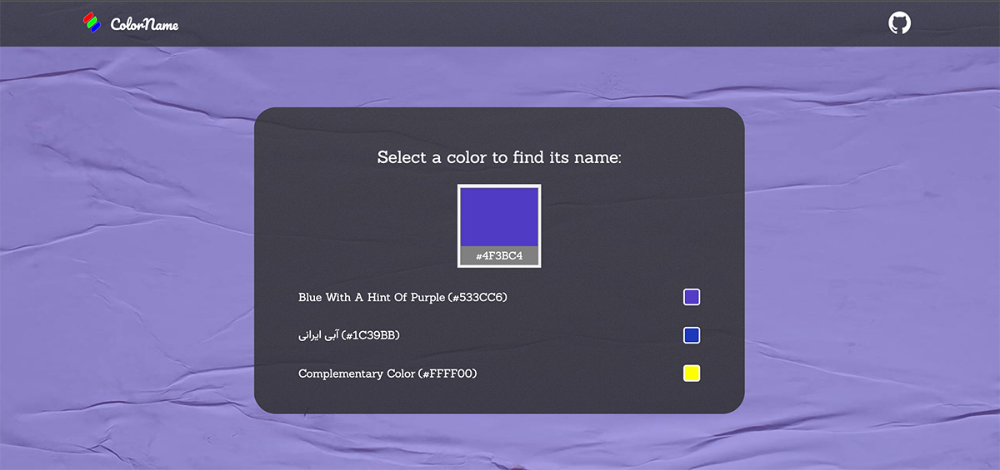

# ColorName.ir 

ColorName.ir is an open-source web application developed with Compose for Web, a reactive web UI framework for Kotlin, based on Google's modern toolkit and brought to you by JetBrains. 

This website is designed to provide the user with the name of a specific color in both English and Farsi. Simply pick a color and the application will return the corresponding name for the color in both languages.

I am looking for contributors to help me add more colors and fix existing ones. The UI was designed by https://dribbble.com/Atiyeh-rzv (Atiyeh Razavi).

## Contributing

If you'd like to contribute to ColorName.ir, please follow these steps:

1. Fork the repository
2. Create a branch for your feature
3. Make your changes
4. Push your branch to your forked repository
5. Create a pull request

## Technology Used

- Compose for Web
- Kotlin
- GitHub Pages
- HTML & CSS
- JavaScript
